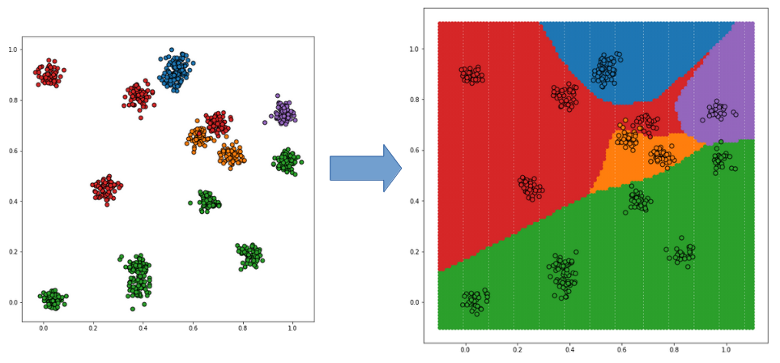

# Classification of 2D-Data with Keras
This is a simple classification example which was constructed by modifying the Keras example https://github.com/fchollet/keras/blob/master/examples/mnist_mlp.py from using MNIST data to easier visualizable 2D-data.

The actual network definition is only 6 lines of code. One can see from this how nicely Keras abstracts from the lower-level frontend (tensorflow in this case). Most of the code below is actually concerned with data generation and visualization of the training results. Thanks to numpy and matplotlib also this can be formulated quite compactly.
